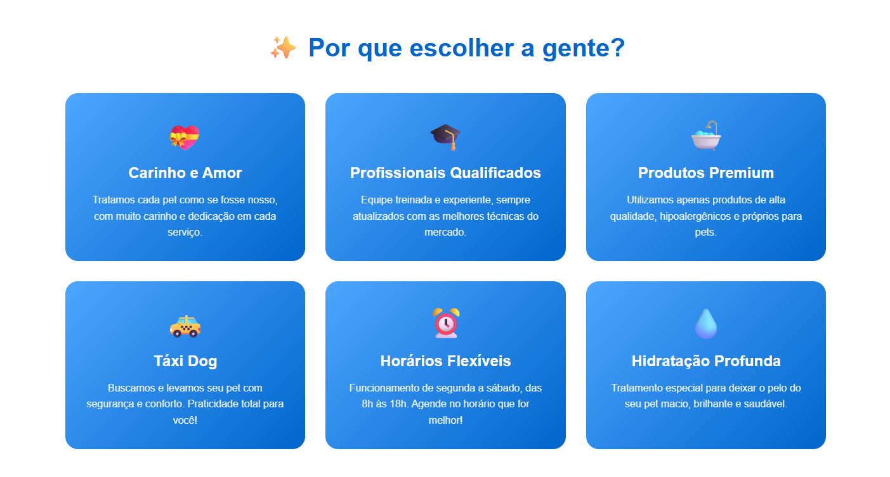

# 🐾 Dany Spa Pet's

Site institucional e sistema de agendamento online para pet shop, desenvolvido com HTML, CSS e JavaScript puro.

## 📋 Sobre o Projeto

O Dany Spa Pet's é uma solução web completa para gerenciamento de agendamentos de serviços pet, incluindo banho, tosa e hidratação. O sistema oferece uma experiência moderna e intuitiva tanto para os clientes quanto para o negócio.





## ✨ Funcionalidades

### Página Inicial (`index.html`)
- 🎨 Design moderno com animações e gradientes vibrantes
- 💫 Bolhas flutuantes animadas no hero
- 📱 Layout 100% responsivo
- 🎯 Seções destacadas:
  - Hero com call-to-action
  - Diferenciais do serviço (6 cards interativos)
  - Galeria de fotos dos pets
  - Depoimentos de clientes
  - Footer com informações de contato

### Sistema de Agendamento (`agendamento.html`)
- 📅 Agendamento inteligente com verificação de conflitos
- ⏰ Sistema de horários disponíveis em tempo real
- 💾 Persistência de dados usando Web Storage API
- 🚫 Bloqueio automático de domingos e feriados nacionais (2025)
- 📊 Resumo do agendamento com cálculo automático de preços
- 🚕 Opção de Táxi Dog com coleta de endereço
- 💧 Hidratação como serviço adicional
- 📱 Integração direta com WhatsApp

## 💰 Tabela de Preços

### Porte Pequeno
- Banho: R$ 50 (40 min)
- Banho e Tosa Higiênica: R$ 60 (40 min)
- Tosa Máquina: R$ 80 (90 min)
- Tosa Tesoura: R$ 150 (180 min)

### Porte Médio
- Banho: R$ 60 (40 min)
- Banho e Tosa Higiênica: R$ 70 (40 min)
- Tosa Máquina: R$ 90 (90 min)
- Tosa Tesoura: R$ 180 (180 min)

### Porte Grande
- Banho: R$ 150 (90 min)
- Banho e Tosa Higiênica: R$ 160 (90 min)
- Tosa Máquina: R$ 180 (120 min)
- Tosa Tesoura: R$ 250 (180 min)

### Serviços Adicionais
- Hidratação: Pequeno +R$ 20 | Médio +R$ 30 | Grande +R$ 40
- Táxi Dog: +R$ 30

## 🛠️ Tecnologias Utilizadas

- **HTML5** - Estrutura semântica
- **CSS3** - Estilização avançada com:
  - Flexbox e Grid Layout
  - Animações e transições
  - Gradientes e efeitos visuais
  - Media queries para responsividade
- **JavaScript** - Lógica de negócio:
  - Manipulação do DOM
  - Validações de formulário
  - Sistema de agendamento
  - Integração com Storage API
  - Cálculos dinâmicos

## 📦 Estrutura do Projeto

```
dany-spa-pets/
│
├── index.html              # Página inicial
├── agendamento.html        # Sistema de agendamento
├── src/
│   └── img-agendamento.png # Imagem da página de agendamento
└── README.md               # Documentação
```

## 🚀 Como Usar

1. **Clone ou baixe o projeto**
   ```bash
   git clone [url-do-repositorio]
   ```

2. **Abra o arquivo `index.html` no navegador**
   - Não requer servidor web
   - Compatível com todos os navegadores modernos

3. **Navegue até a página de agendamento**
   - Clique em "Agendar Agora" ou acesse `agendamento.html` diretamente

4. **Configure o número do WhatsApp**
   - No arquivo `agendamento.html`, linha ~240
   - Altere a variável `phoneNumber` para seu número (formato: 5515991345227)

## ⚙️ Configurações Importantes

### Horário de Funcionamento
- Segunda a Sábado: 8h às 18h
- Domingos e Feriados: Fechado

### Feriados Nacionais 2025 (Pré-configurados)
- 01/01 - Ano Novo
- 17-18/02 - Carnaval
- 18/04 - Paixão de Cristo
- 21/04 - Tiradentes
- 01/05 - Dia do Trabalho
- 19/06 - Corpus Christi
- 07/09 - Independência
- 12/10 - Nossa Senhora Aparecida
- 02/11 - Finados
- 15/11 - Proclamação da República
- 20/11 - Consciência Negra
- 25/12 - Natal

### Sistema de Agendamento
- **Intervalo de horários**: 10 minutos
- **Margem entre agendamentos**: 10 minutos (preparação/limpeza)
- **Validações automáticas**:
  - Bloqueio de horários passados
  - Verificação de conflitos
  - Verificação de horário de fechamento
  - Bloqueio de domingos/feriados

## 💾 Armazenamento de Dados

O sistema utiliza a **Web Storage API** para persistir agendamentos:

```javascript
// Salvar agendamento
await window.storage.set('agendamento:timestamp', JSON.stringify(data));

// Carregar agendamentos
const result = await window.storage.list('agendamento:');

// Buscar agendamento específico
const data = await window.storage.get('agendamento:key');
```

**Nota**: Os dados são armazenados localmente no navegador. Para um ambiente de produção, considere implementar um backend com banco de dados.

## 📱 Integração WhatsApp

O sistema gera automaticamente uma mensagem formatada e abre o WhatsApp Web com todos os detalhes do agendamento:
- Dados do pet e tutor
- Serviço selecionado
- Data e horário
- Serviços adicionais
- Valor total
- Endereço (se Táxi Dog)

## 🎨 Paleta de Cores

- **Azul Primário**: #0066cc
- **Azul Claro**: #4da6ff
- **Azul Suave**: #80bfff
- **Fundo**: #f0f8ff
- **Branco**: #ffffff
- **Texto**: #333333

## 📱 Responsividade

O site é totalmente responsivo e se adapta a:
- 📱 Smartphones (< 768px)
- 💻 Tablets (768px - 1024px)
- 🖥️ Desktop (> 1024px)

## 🔧 Personalizações Possíveis

1. **Alterar preços**: Edite o objeto `services` no JavaScript
2. **Modificar horários**: Ajuste os valores no loop da função `gerarHorarios()`
3. **Adicionar feriados**: Inclua datas no array `feriados2025`
4. **Mudar cores**: Edite as variáveis CSS no `<style>`
5. **Trocar imagens**: Substitua as URLs do Unsplash ou adicione imagens locais

## 📞 Contato

- 📍 Localização: Porto Feliz, São Paulo

## 📄 Licença

Este projeto é de uso livre para fins educacionais e comerciais.

## 🤝 Contribuições

Sugestões e melhorias são bem-vindas! Sinta-se à vontade para:
- Reportar bugs
- Sugerir novas funcionalidades
- Melhorar a documentação
- Compartilhar o projeto

---
## 👩‍💻 Autora

**Danielly Pedrini**

- GitHub: [Danielly Pedrini](https://github.com/danielly-pedrini)
- LinkedIn: [[Danielly Pedrini](https://www.linkedin.com/in/daniellypedrini/)]


Desenvolvido com 💙 para o Dany Spa Pet's 🐾